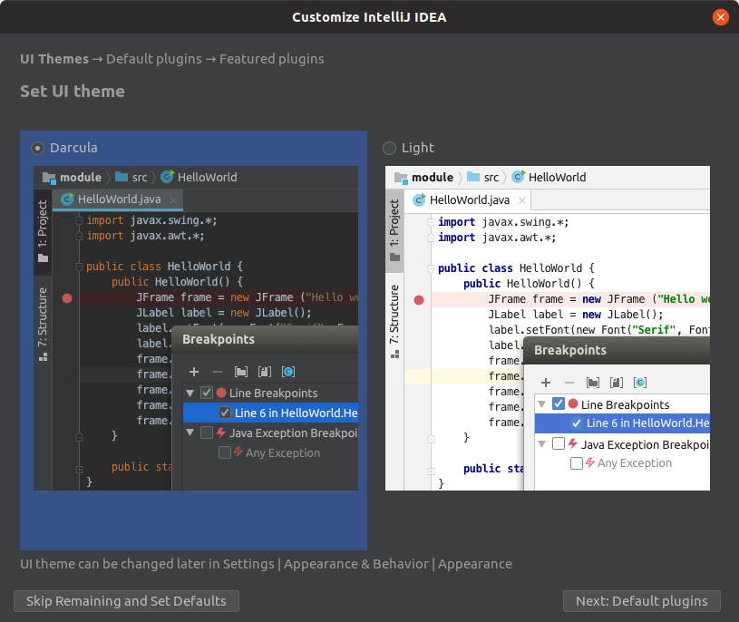
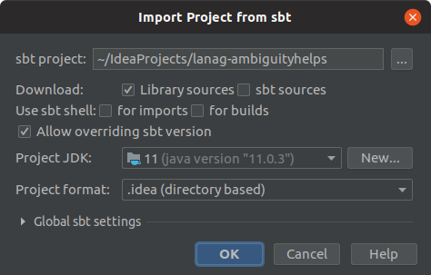

# LANguage AGents - Project Ambiguity Helps

This simulation project builds on the Rational Speech Act theory by Frank & Goodman (2012). Here, we investigate
the effects of lexicon ambiguity, order of pragmatic reasoning and asymmetry between agents on the agent's
ability to successfully communicate.

This project consists of base code found in `com.markblokpoel.lanag.ambiguityhelps` to build your own
Rational Speech Act-based experiments and three simulation experiments in
`com.markblokpoel.lanag.ambiguityhelps.experiments`. The results of these experiments are published in Blokpoel,
Dingemanse, Toni and van Rooij, 2019). All three simulation experiments have pairs of agents taking turns to
communicate for `n` rounds in a 1-shot communication task. That is, agent 1 selects a random referent,
generates a signal; then agent 2 infers a referent from the signal. Then they switch roles and do another turn.
The simulation keeps track of different statistics, amongst others the success rate. The three simulations differ in
how the agents' lexicons are generated:

**Randomized pairs:** Here, we randomly generate a lexicon based on a density parameter. Dense lexicons have many
signal-referent relationships with value 1.0, sparse lexicons with value 0.0. The interlocutor's lexicon is a mutated
copy of this first lexicon, where mutation-rate is varied as a parameter. This leads to lexicons where each signal
can have a very different level of ambiguity from the next. Hence, we measure the mean and variance lexicon ambiguity.

**Consistent pairs:** Here, we generate a random lexicon, but under the constraint that each signal refers to at
least 1 referent ''and'' all signals refer to the same amount of referents. The interlocutor's lexicon is generated
from the first lexicon, but randomly transformed using one of four methods: subtraction (randomly removing
`n`% signal-referent mappings from each signal), addition (randomly adding `n`% signal-referent
mappings from each signal), swap (randomly swap around the mappings between two signals) or random (generate a second
consistent lexicon from scratch). Since there is no variance in ambiguity between signals, we can measure the ambiguity
of a lexicon in just mean ambiguity.

'''Structures pairs''':

##Running the simulations
The simulation platform uses Apache Spark to parallelize the computations. You can run them in three ways: Locally
on your machine from within an IDE (e.g., IntellijIDEA), locally on your machine using `spark-submit`
from a terminal, or on a Spark/Hadoop server (e.g., [Amazon services](https://aws.amazon.com/emr/features/spark/)).

## Running on a local machine
Whether you rung the simulations from within an IDE (we will use IntellijIDEA) or from the commandline, you will first
need to install Apache Spark and optionally Apache Hadoop.

### Install Spark on OSX or Linux
The simulation framework requires Java JDK 1.8 (or higher) and Spark version 2.4.2 (higher version should be compatible
but are untested). Go to the [Spark website](https://spark.apache.org/downloads.html) and download Spark pre-build for Apache Hadoop 2.7
and later. We will describe installation for a single user, **root access is not required** so don't use it during installation. Open a terminal and in your home
directory create a folder `libraries`.

```
$ mkdir ~/libraries
```

Unpack the contents of the of `spark-2.4.2-bin-hadoop2.7.tgz` to the libraries folder:

```
$ cd ~/libraries
$ tar -xvf spark-2.4.2-bin-hadoop2.7.tgz
$ rm spark-2.4.2-bin-hadoop2.7.tgz
```

Create a symbolic link for easier upgrading to newer Spark versions:

```
$ ln -s ~/libraries/spark-2.4.2-bin-hadoop2.7 ~/libraries/spark
```

We now need to configure Spark and your `PATH` variable. Again, from the terminal edit your profile using
your favorite editor (e.g., Vim or Nano). It should be located in `~/.bash_profile` (for OSX) or
`~/.profile` for Linux. Add the following lines at the start of the file, assuming the Java compiler is
located in `/usr/bin` (you can use `which javac`):

```
SPARK_HOME=~/libraries/spark
JAVA_HOME=$(readlink -f /usr/bin/javac | sed "s:/bin/javac::")
```

Add the following line at the end of the file:

```
PATH=$SPARK_HOME/bin:$PATH
```

Close and save the file. Now restart your terminal session or reload your profile by running:

```
$ source .bash_profile
```

Start a Spark shell from your home directory to test if installation is successful:

```
$ spark-shell
```

#### Optionally install Hadoop native library
_Do not try to install Hadoop with native library, unless you have the spark-shell correctly installed._

Running the simulations using the Hadoop native library potentially improves performance, but only on RHEL4/Fedora,
Ubuntu or Gentoo (see Hadoop 3.1.2 documentation). First download Apache Hadoop 3.1.2 binaries (or higher)
[here](https://hadoop.apache.org/releases.html). Unpack the contents of the of `hadoop-3.1.2.tar.gz` to
your libraries folder:

```
$ cd ~/libraries
$ tar -xvf hadoop-3.1.2.tar.gz
$ rm hadoop-3.1.2.tar.gz
```

Create a symbolic link for easier upgrading to newer Spark versions:

```
$ ln -s ~/libraries/hadoop-3.1.2 ~/libraries/hadoop
```

Open `~/.profile` or `~/.bash_profile` with an editor and add:

```
HADOOP_HOME=~/libraries/hadoop
HADOOP_CONF_DIR=$HADOOP_HOME/conf
```

And add the following line to the end of the file:
```
PATH=$HADOOP_HOME/bin:$PATH
```

Save and close the file. Next, we need to configure Hadoop. In the terminal:

```
$ cd ~/libraries/hadoop/etc/hadoop
$ vim hadoop-env.sh
```

Save and close the file. Uncomment `# JAVA_HOME=..` and replace the line with:

```
JAVA_HOME=$(readlink -f /usr/bin/javac | sed "s:/bin/javac::")
```

You can test if Hadoop is configured properly by running `hadoop` without any error messages.

Now we need to configure Spark to use the Hadoop native library. In terminal:

```
$ cd ~/libraries/spark/conf
$ cp spark-env.sh.template spark-env.sh
$ vim spark-env.sh
```

Add the following line somewhere after `# Options read when launching programs locally with`:

```
export SPARK_DIST_CLASSPATH=$(hadoop classpath)
```

This might not be enough to get the Hadoop native libraries to load. You can always fall back to the Java
implementation. You can try to add the following line to the shell scripts to force loading the native library. Note:
use absolute path to your hadoop folder:

```
  --conf spark.driver.extraLibraryPath=/home/[username]/libraries/hadoop/lib/native \
```

### Install Spark on Windows
It is highly recommended to run Spark on a Unix OS such as Mac OSX or Linux. If you want to run Spark locally
on your Windows machine, you may try to build Spark from source (not recommended) or run within a Virtual Machine,
e.g. using [Virtual Box](https://www.virtualbox.org/) and [Ubuntu](https://www.ubuntu.com/#download).

### Installing and setting up IntelliJ

Ideally, install the software through the software manager by searching for `idea` (Linux).  Otherwise, download the IDE [here](https://www.jetbrains.com/idea/) (Linux, Mac).

Once you have launched the application you will have to go through the following steps:

Select your preferred theme and click `Next: Default plugins`.



Optionally, disable Swing and Android, as they are are not used for the simulation and click `Next: Featured plugins`.


Install Scala, and optionally IdeaVim and IDE Features Trainer.


Now you should see the following menu:


Click on `Check out from Version Control` and select Git.

Enter: `https://github.com/markblokpoel/lanag-ambiguityhelps.git` in the URL field.


Select Yes.


Select OK.


This is the final window you should see after the installation.
Wait until the bar in the bottom has finished loading.
Select Project on the left vertical bar to see the project.


### Running simulation from IntellijIDEA
Intellij will ignore `% Provided` library dependencies by default. However, this means it cannot find the
Spark libraries and you will get an error message. These library dependencies have to be tagged as such, because these
are assumed to be supplied by the Spark server and need to be excluded from the JAR assembly line. To run a simulation
from within Intellij, you must edit the run configuration and under "Configuration" check the option "Include
dependencies with Provided scope". Furthermore, in the configuration file `resources/application.conf` set
`spark-local-mode = true`.

### Running simulations from the command line interface
Create a JAR file using the SBT command `assembly`. Move the newly created JAR file to a folder of your
choosing and also copy the application.conf file there. Additionally, you can copy the `ah-*.sh` shell
execution scripts, or use the command manually in case you want to customize the running script. The scripts assume
you are running Spark locally.

```
spark-submit \
  --conf spark.driver.extraJavaOptions=-Dconfig.file=./application.conf \
  --conf spark.executor.extraJavaOptions=-Dconfig.file=./application.conf \
  --class com.markblokpoel.lanag.ambiguityhelps.experiments.RSA1ShotConsistent \
  --master local[4] \
  com.markblokpoel.lanag-ambiguityhelps-assembly-0.1.jar
```

If you use the scripts, you need to set their permissions to be executable. In a terminal type:

```
$ chmod +x ah-consistent.sh
$ chmod +x ah-random.sh
$ chmod +x ah-structured.sh
```

Execute the scripts via terminal:

```
./ah-consistent.sh
```

### Running on a service / server
To be written...
