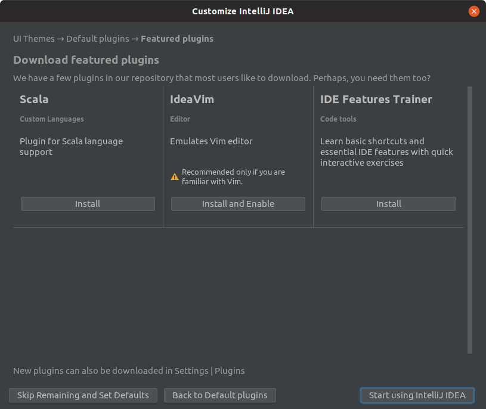
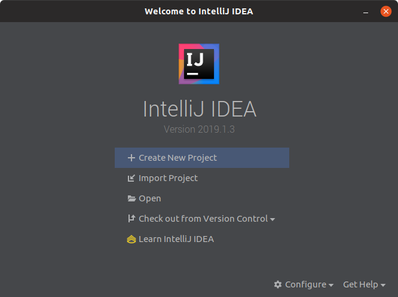

# Advanced README
Whether you compile the software manually or use the binary provided you will first need to install the Java JDK 1.8
(or higher) and Spark version 2.4.2 (higher version should be compatible but are untested). After you have
successfully installed these components on your system you can either 

## Requirements (Java JDK 1.8 and Apache Spark 2.4.2 or higher)
1. Install the Java JDK 1.8 or higher from the [Oracle website](https://www.oracle.com/technetwork/java/javase/downloads/index.html)
or alternatively [OpenJDK framework](https://openjdk.java.net/install/index.html).
1. Go to the [Spark website](https://spark.apache.org/downloads.html) and download Spark pre-build for Apache Hadoop 2.7
or higher. We will describe installation for a single user, **root access is not required** so don't use it during
installation. Open a terminal and in your home directory create a folder `libraries`.

```
$ mkdir ~/libraries
```

Unpack the contents of the of `spark-2.4.2-bin-hadoop2.7.tgz` to the libraries folder:

```
$ cd ~/libraries
$ tar -xvf spark-2.4.2-bin-hadoop2.7.tgz
$ rm spark-2.4.2-bin-hadoop2.7.tgz
```

Create a symbolic link for easier upgrading to newer Spark versions:

```
$ ln -s ~/libraries/spark-2.4.2-bin-hadoop2.7 ~/libraries/spark
```

We now need to configure Spark and your `PATH` variable. Again, from the terminal edit your profile using
your favorite editor (e.g., Vim or Nano). It should be located in `~/.bash_profile` (for OSX) or
`~/.profile` for Linux. Add the following lines at the start of the file, assuming the Java compiler is
located in `/usr/bin` (you can use `which javac`):

```
SPARK_HOME=~/libraries/spark
JAVA_HOME=$(readlink -f /usr/bin/javac | sed "s:/bin/javac::")
```

Add the following line at the end of the file:

```
PATH=$SPARK_HOME/bin:$PATH
```

Close and save the file. Now restart your terminal session or reload your profile by running:

```
$ source .bash_profile
```

Start a Spark shell from your home directory to test if installation is successful:

```
$ spark-shell
```

### Optionally install Hadoop native library
_Do not try to install Hadoop with native library, unless you have the spark-shell correctly installed._

Running the simulations using the Hadoop native library potentially improves performance, but only on RHEL4/Fedora,
Ubuntu or Gentoo (see Hadoop 3.1.2 documentation). First download Apache Hadoop 3.1.2 binaries (or higher)
[here](https://hadoop.apache.org/releases.html). Unpack the contents of the of `hadoop-3.1.2.tar.gz` to
your libraries folder:

```
$ cd ~/libraries
$ tar -xvf hadoop-3.1.2.tar.gz
$ rm hadoop-3.1.2.tar.gz
```

Create a symbolic link for easier upgrading to newer Spark versions:

```
$ ln -s ~/libraries/hadoop-3.1.2 ~/libraries/hadoop
```

Open `~/.profile` or `~/.bash_profile` with an editor and add:

```
HADOOP_HOME=~/libraries/hadoop
HADOOP_CONF_DIR=$HADOOP_HOME/conf
```

And add the following line to the end of the file:
```
PATH=$HADOOP_HOME/bin:$PATH
```

Save and close the file. Next, we need to configure Hadoop. In the terminal:

```
$ cd ~/libraries/hadoop/etc/hadoop
$ vim hadoop-env.sh
```

Uncomment `# JAVA_HOME=..` and replace the line with:

```
JAVA_HOME=$(readlink -f /usr/bin/javac | sed "s:/bin/javac::")
```

You can test if Hadoop is configured properly by running `hadoop` without any error messages.

Now we need to configure Spark to use the Hadoop native library. In terminal:

```
$ cd ~/libraries/spark/conf
$ cp spark-env.sh.template spark-env.sh
$ vim spark-env.sh
```

Add the following line somewhere after `# Options read when launching programs locally with`:

```
export SPARK_DIST_CLASSPATH=$(hadoop classpath)
```

This might not be enough to get the Hadoop native libraries to load. You can always fall back to the Java
implementation. You can try to add the following line to the shell scripts to force loading the native library. Note:
use absolute path to your hadoop folder:

```
  --conf spark.driver.extraLibraryPath=/home/[username]/libraries/hadoop/lib/native \
```

### Install Spark on Windows
It is highly recommended to run Spark on a Unix OS such as Mac OSX or Linux. If you want to run Spark locally
on your Windows machine, you may try to build Spark from source (not recommended) or run within a Virtual Machine,
e.g. using [Virtual Box](https://www.virtualbox.org/) and [Ubuntu](https://www.ubuntu.com/#download).

## Compiling and running the source code
We recommend using IntelliJ IDEA for compiling the source code. Ideally, install the software through your operating
system's software manager by searching for `idea` (Linux).  Otherwise, download the IDE
[here](https://www.jetbrains.com/idea/) (Linux, Mac).

Once you have launched the application you will have to go through the following steps:

Select your preferred theme and click `Next: Default plugins`.


Optionally, disable Swing and Android, as they are are not used for the simulation and click `Next: Featured plugins`.


Install Scala, and optionally IdeaVim and IDE Features Trainer.



Now you should see the following menu:



Click on `Check out from Version Control` and select Git.

Enter: `https://github.com/markblokpoel/lanag-ambiguityhelps.git` in the URL field.


Select Yes.


Select OK.


This is the final window you should see after the installation.
Wait until the bar in the bottom has finished loading.
Select Project on the left vertical bar to see the project.


### Compile and run the simulation from IntellijIDEA
IntelliJ will ignore `% Provided` library dependencies defined in `build.sbt` by default. However, this means it cannot find the
Spark libraries and you will get an error message. These library dependencies have to be tagged as such, because these
are assumed to be supplied by the Spark server and need to be excluded from the JAR assembly line. To run a simulation
from within IntelliJ, you must create or edit a run configuration and under "Configuration" check the option "Include
dependencies with Provided scope". Furthermore, in the configuration file `resources/application.conf` set
`spark-local-mode = true`. The following classes are executable:
- `experiments.uniform.UniformExperiment`
- `experiments.random.RandomExperiment`
- `experiments.structured.StructuredExperiment`

## Running simulations from the command line interface
To run the simulation from the command line you need a binary. You can compile a JAR file using the SBT command
`assembly`. This will create a fresh binary in `./target/scala-2.12/`. Move the newly created JAR file to a folder of your
choosing and also copy the [`application.conf`](../src/main/resources/application.conf) file there. Additionally, you
can copy the `ah-*.sh` shell execution scripts, or use the command manually in case you want to customize the running script. The scripts assume
you are running Spark locally.

```
spark-submit \
  --conf spark.driver.extraJavaOptions=-Dconfig.file=./application.conf \
  --conf spark.executor.extraJavaOptions=-Dconfig.file=./application.conf \
  --class com.markblokpoel.lanag.ambiguityhelps.experiments.RSA1ShotConsistent \
  --master local[*] \
  com.markblokpoel.lanag-ambiguityhelps-assembly-0.1.jar
```

If you use the scripts, you need to set their permissions to be executable. In a terminal type:

```
$ chmod +x ah-consistent.sh
$ chmod +x ah-random.sh
$ chmod +x ah-structured.sh
```

Execute the scripts via terminal:

```
./ah-consistent.sh
```

## Running on a service / server
With all means of running the simulation you can provide a master for running the simulation. If you have
a dedicated Spark cluster available, you can change the master from `local[*]` (which runs the simulation on
a local machine with the maximum number of cores available) to any remote Yarn cluster. For more details, see
the [Apache Spark documentation](https://spark.apache.org/docs/latest/submitting-applications.html#master-urls).